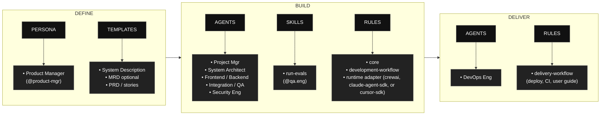

# AAMAD – AI-Assisted Multi-Agent Application Development Framework

## Chat de suporte: demonstracao local

A primeira etapa do frontend e um chat de suporte de TI em pt-BR com dados ficticios e servicos mockados. Nao ha backend, persistencia, console admin nem conexao ServiceNow nesta etapa.

Requer Node.js >=20.19 ou >=22.12 e npm. Na raiz do projeto:

```bash
cd src/frontend
npm ci
npm run dev
npm test
npm run typecheck
npm run build
```

Abra a URL exibida por `npm run dev` (por padrao `http://localhost:5173/`). Neste ambiente WSL, caso o `npm` do PATH aponte para o Windows, use `corepack npm` no lugar de `npm` para cada comando.

O exemplo de redefinicao de senha ja aparece no campo de entrada. Clique em **Executar** para acompanhar a resposta e a fonte; **Reiniciar** limpa o historico local. A documentacao de contrato e criterios esta em `project-context/2.build/frontend-funcional-spec.md`, com decisoes em `project-context/2.build/frontend.md`.

Ponto de integracao futura (`@integration.eng`): trocar `startRun` e `getRunStatus` em `src/frontend/mockRuns.ts` pela criacao de sessao `POST /api/chat/sessions`, envio `POST /api/chat/sessions/{session_id}/messages` e consulta `GET /api/agent-runs/{agent_run_id}` do SAD. Essas funcoes sao abstracoes do frontend, nao endpoints adicionais; acordar payloads com o backend antes da substituicao.

**AAMAD** e um framework aberto, production-grade, para construir, implantar e evoluir aplicacoes multi-agent usando boas praticas de context engineering.  
Ele sistematiza planejamento orientado por pesquisa, workflows modulares com agentes de IA e pipelines rapidos de MVP/devops para solucoes de IA prontas para contexto enterprise.

---

## Table of Contents

- [What is AAMAD?](#what-is-aamad)
- [What AAMAD is not](#what-aamad-is-not)
- [Principles and benefits](#principles-and-benefits)
- [Core Concepts](#core-concepts)
- [AAMAD phases at a glance](#aamad-phases-at-a-glance)
- [Installation](#installation)
- [Using AAMAD in your IDE](#using-aamad-in-your-ide)
- [Repository Structure](#repository-structure)
- [Runtime adapters](#runtime-adapters)
- [How to Use the Framework](#how-to-use-the-framework)
- [Phase 1: Define Workflow (Product Manager)](#phase-1-define-stage-product-manager)
- [Phase 2: Build Workflow (Multi-Agent)](#phase-2-build-stage-multi-agent)
- [Phase 3: Deliver Stage (DevOps)](#phase-3-deliver-stage-devops)
- [Contributing](#contributing)
- [License](#license)

---

## What is AAMAD?

AAMAD e um framework de context engineering baseado em boas praticas de AI-assisted coding e metodologias de desenvolvimento de sistemas multi-agent.  
Ele permite que equipes:

- Iniciem projetos com AI agents autonomos ou colaborativos
- Prototipem MVPs rapidamente com limites claros de contexto
- Usem patterns de arquitetura/design prontos para producao
- Acelerem delivery, reduzam overhead manual e habilitem iteracao continua

No AAMAD, o development crew (personas, rules, templates e artifacts) e a metodologia estavel.  
Runtime adapters sao uma escolha de implementacao para o backend runtime que o MVP gerado deve usar.

Voce pode usar AAMAD em multiplos ambientes de desenvolvimento: veja [Using AAMAD in your IDE](#using-aamad-in-your-ide) para Cursor, Claude Code e VS Code + GitHub Copilot.

---

## What AAMAD is not

- AAMAD nao e um runtime orchestrator programatico para suas proprias fases Define → Build → Deliver.
- A selecao de runtime adapter nao muda a orquestracao das fases AAMAD; ela apenas muda as convencoes de runtime usadas pelas implementation personas na Build-phase.
- Headless orchestration das fases AAMAD permanece fora de escopo (veja release notes / changelog atuais).

---

## Principles and benefits

AAMAD transforma “vibe coding” de prompting ad-hoc em um workflow **context-first, persona-driven**:

- **Single-responsibility personas** possuem epics claros (Define → Build → Deliver) com inputs, outputs e acoes proibidas explicitas.
- **Artifacts over chat memory:** PRD, SAD e phase docs em `project-context/` tornam decisoes auditaveis e reproduziveis.
- **Runtime adapters are an implementation choice** (`AAMAD_TARGET_RUNTIME`), nao a metodologia em si.
- **Quality gates** (required headings, `aamad validate` opcional, QA → security → deliver) mantem o escopo do MVP honesto.

**Beneficios esperados:** requirements mais claros antes do codigo, menos retrabalho por prompts subespecificados, handoffs rastreaveis entre agentes e documentacao que continua util quando voce sincroniza novamente apos code changes.

---

## Core Concepts

- **Persona-driven development:** Cada workflow e pertencente e documentado por uma AI agent persona clara, com principio de responsabilidade unica.
- **Context artifacts:** Todas as acoes, decisoes e documentacoes importantes sao armazenadas como markdown artifacts, garantindo explainability e reproducibility.
- **Quality gates:** Required artifact headings, `aamad validate` opcional e sequenciamento QA → evals → security → deliver.
- **Evals as acceptance criteria:** Success thresholds mensuraveis (accuracy, latency, safety, security, cost) definidos antes da Build no SAD e implementados como uma golden-dataset eval suite (`*run-evals`) que bloqueia alteracoes futuras de model/prompt.
- **Project configuration:** `aamad.config.yml` opcional para preferencias compartilhadas de language, UI, testing e security entre personas.
- **Documentation sync:** Apos melhorar o codigo gerado, use `prompt-sync-docs` para manter `project-context/` alinhado com a implementacao.
- **Parallelizable epics:** Tarefas grandes sao quebradas em epics, tornando o desenvolvimento mais rapido e autonomo enquanto mantem controle de qualidade.
- **Reusability:** Framework reutilizavel para qualquer projeto; basta inserir seu PRD/SAD e deixar os agentes executarem.
- **Open, transparent, and community-driven:** Todos os patterns e artifacts sao legiveis, auditaveis e extensíveis.

---

## AAMAD phases at a glance

AAMAD organiza o trabalho em tres fases: Define, Build e Deliver, cada uma com artifacts, personas e rules claros para manter o desenvolvimento auditavel e reutilizavel. 
O fluxo comeca definindo contexto e templates, segue pela execucao multi-agent da Build e termina com delivery operacional.



- **Phase 1 (Define):** A persona Product Manager (`@product-mgr`) conduz elicitation estruturada (recomendada), MRD opcional para produtos comerciais e PRD/user stories para padronizar o escopo do projeto.

- **Phase 2 (Build):** Execucao multi-agent por Project Manager, System Architect, Frontend Engineer, Backend Engineer, Integration Engineer, QA Engineer (unit + integration stages) e Security Engineer (recomendado), governada por core/development-workflow rules e pela regra do runtime adapter selecionado.

- **Phase 3 (Deliver):** DevOps Engineer (`@devops.eng`) empacota o MVP validado usando a regra `delivery-workflow`; artifacts incluem `project-context/3.deliver/deploy.md` e, opcionalmente, `user-guide.md`.

---

## Installation

Instale AAMAD pelo PyPI e inicialize o framework para sua IDE:

```bash
pip install aamad
# or
uv pip install aamad
```

### Multi-IDE support

AAMAD suporta **Cursor**, **Claude Code** e **VS Code + GitHub Copilot**. Escolha sua IDE com a flag `--ide`:

```bash
aamad init --ide cursor        # Default: Cursor
aamad init --ide claude-code  # Claude Code
aamad init --ide vscode       # VS Code + GitHub Copilot
```

#### Framework feature implementation by IDE

| Feature | Cursor | Claude Code | VS Code + Copilot |
| :------ | :----- | :---------- | :---------------- |
| **Rules / instructions** | `.cursor/rules/*.mdc` with `alwaysApply: true` | `.claude/CLAUDE.md` + `.claude/rules/*.md` | `.github/instructions/*.instructions.md` |
| **Rule format** | `.mdc` (YAML frontmatter + markdown body) | `.md` (plain markdown) | `.instructions.md` (`applyTo`, `name`, `description`) |
| **Glob-based scoping** | ✅ `globs:` in frontmatter | ❌ Not supported (all rules loaded) | ✅ `applyTo:` in frontmatter |
| **Agent definitions** | `.cursor/agents/*.md` | `.claude/agents/*.md` | `.github/agents/*.agent.md` |
| **Agent invocation** | `@agent-name` in chat | Delegation via `description`; explicit request | Agent dropdown; `@agent-name`; handoff buttons |
| **Tool enforcement** | Instructions-based | ✅ Hard allowlist/denylist | ✅ Tool allowlist in frontmatter |
| **Phase 1 prompt** | `.cursor/prompts/prompt-phase-1` | `.claude/commands/phase-1-define.md` (slash command) | `.github/prompts/phase-1-define.prompt.md` |
| **Skills** | `.cursor/skills/run-evals/` | `.claude/skills/run-evals/` (native skills) | `.github/prompts/run-evals.prompt.md` (bound to `qa-eng`; no native skills primitive) |
| **Templates** | `.cursor/templates/` (shared) | `.cursor/templates/` (shared) | `.cursor/templates/` (shared) |
| **Project context** | `project-context/` (shared) | `project-context/` (shared) | `project-context/` (shared) |
| **Bridge file** | `AGENTS.md` (root) | `AGENTS.md` (root) | `AGENTS.md` (root) |

---

### Cursor

**Instale e inicialize:**

```bash
python -m venv .venv
source .venv/bin/activate   # Windows: .venv\Scripts\activate
pip install aamad
aamad init --ide cursor --dest .
```

Or with uv:

```bash
uv venv
uv pip install aamad
uv run aamad init --ide cursor --dest .
```

**Folder structure after init:**

```
your-project/
├── .cursor/
│   ├── agents/          # Persona definitions (@product-mgr, @backend.eng, etc.)
│   ├── prompts/         # Prompts por fase (e.g. prompt-phase-1)
│   ├── rules/           # Rules always-on (*.mdc)
│   ├── skills/          # Agent skills (e.g. run-evals)
│   └── templates/      # PRD, SAD, MR templates
├── project-context/
│   ├── 1.define/        # Outputs MRD, PRD, SAD
│   ├── 2.build/         # setup.md, frontend.md, backend.md, etc.
│   └── 3.deliver/       # deploy runbook e configs
├── AGENTS.md            # Bridge file (descoberta pela IDE)
├── CHECKLIST.md
└── README.md
```

---

### Claude Code

**Instale e inicialize:**

```bash
python -m venv .venv
source .venv/bin/activate
pip install aamad
aamad init --ide claude-code --dest .
```

Or with uv:

```bash
uv venv
uv pip install aamad
uv run aamad init --ide claude-code --dest .
```

**Folder structure after init:**

```
your-project/
├── .claude/
│   ├── CLAUDE.md        # Rules summary + cross-references
│   ├── agents/          # Persona definitions (Claude Code format)
│   ├── commands/        # Slash commands (e.g. phase-1-define)
│   ├── rules/           # Arquivos de rule individuais (*.md)
│   ├── skills/          # Agent skills (e.g. run-evals, native Claude Code skills)
│   └── settings.json    # Permissions, env AAMAD_TARGET_RUNTIME
├── .cursor/
│   └── templates/       # PRD, SAD, MR templates (shared)
├── project-context/
│   ├── 1.define/
│   ├── 2.build/
│   └── 3.deliver/
├── AGENTS.md
├── CHECKLIST.md
└── README.md
```

---

### VS Code + GitHub Copilot

**Instale e inicialize:**

```bash
pip install aamad
aamad init --ide vscode --dest .
```

Or with uv:

```bash
uv pip install aamad
uv run aamad init --ide vscode --dest .
```

**Folder structure after init:**

```
your-project/
├── .github/
│   ├── instructions/   # Copilot instructions (*.instructions.md)
│   ├── agents/         # Custom agents (*.agent.md) com handoffs opcionais
│   └── prompts/        # Phase 1 prompt, sync-docs, run-evals (phase-1-define.prompt.md, ...)
├── .vscode/
│   └── settings.json   # chat.instructionsFilesLocations, chat.agentFilesLocations
├── .cursor/
│   └── templates/      # PRD, SAD, MR templates (compartilhados)
├── project-context/
│   ├── 1.define/
│   ├── 2.build/
│   └── 3.deliver/
├── AGENTS.md
├── CHECKLIST.md
└── README.md
```

**Required extensions:** GitHub Copilot, GitHub Copilot Chat. Recomendadas: Python (ms-python), YAML (redhat).

---

### Using AAMAD in your IDE

Como voce interage com AAMAD depende da sua IDE. O framework produz os mesmos artifacts (`project-context/`, templates, Phase 1 prompt); apenas rules e agent scaffolding mudam.

#### Workflow and context (per IDE)

| What you do | Cursor | Claude Code | VS Code + Copilot |
| :---------- | :----- | :---------- | :---------------- |
| **Start a fresh context** (e.g. novo module) | `Cmd+Shift+P` → **New Chat** | `/clear` ou iniciar uma nova sessao | Iniciar uma nova chat session |
| **Invoke a persona** | Digite `@backend.eng` (ou outro agent) no chat | Peca para usar o subagent pelo nome, ou referencie sua description | Escolha o agent no dropdown, ou use `@agent-name` |
| **Reference a file** | `@path/to/file` no chat | `@path/to/file` no prompt | `#file:path/to/file` ou arraste o arquivo |
| **Phase transitions** (Define → Build → Deliver) | Troque de persona manualmente no chat | Use subagent chaining ou instrucoes explicitas | Use botoes de **handoff** na chat UI (quando configurados) |

#### Capability comparison

| Capability | Cursor | Claude Code | VS Code + Copilot |
| :--------- | :----- | :---------- | :---------------- |
| **AAMAD support** | Nativo (default) | Via `aamad init --ide claude-code` | Via `aamad init --ide vscode` |
| **Glob-based rule scoping** | Sim | Nao (todas as rules carregadas) | Sim (`applyTo:` em instructions) |
| **Tool enforcement** | Apenas instructions | Hard allowlist/denylist | Tool allowlist no agent frontmatter |
| **Agent handoffs** | Manual | Manual ou subagent chaining | Botoes nativos de UI (Define → Build → Deliver) |
| **Parallel work** | Multiplas chat tabs | Subagents / Agent Teams | Subagents |
| **Model choice** | Multi-model | Claude models | Multi-model (GPT, Claude, Gemini, etc.) |
| **Best for** | AAMAD como desenhado | Uso CLI-first, solo | Times, enterprise, diversidade de models |

#### What is the same in all IDEs

Estes itens sao **IDE-agnostic** — nao mudam quando voce troca de IDE:

- **`project-context/`** — Directory layout e todos os outputs Phase 1/2/3 (MRD, PRD, SAD, setup.md, frontend.md, backend.md, integration.md, qa.md).
- **Templates** — PRD, SAD, MR templates (em `.cursor/templates/`; compartilhados entre IDEs).
- **Phase 1 prompt** — Usavel em qualquer AI chat; mesmo conteudo em Cursor prompts, Claude Code commands ou VS Code prompts.
- **Crew logic and artifacts** — A mesma metodologia persona/rules/templates independentemente da IDE.
- **Git and dependency setup** — Mesmo repo e workflow `pyproject.toml`.

O que **muda** por IDE: onde rules e agents ficam (`.cursor/`, `.claude/` ou `.github/`) e como voce invoca personas e referencia arquivos (veja a tabela acima).

---

**CLI flags:**

- `--dest PATH` — Output directory (default: current directory)
- `--ide {cursor,claude-code,vscode}` — Target IDE (default: cursor)
- `--overwrite` — Permite substituir arquivos existentes
- `--dry-run` — Previsualiza o que seria escrito

Inspecione bundle contents: `aamad bundle-info --verbose` ou `aamad bundle-info --ide claude-code`. Para `--ide vscode`, artifacts sao gerados a partir do Cursor bundle (sem bundle separado).

---

## Repository Structure

    aamad/
    ├─ .cursor/
    │   ├─ agents/       # Agent persona definitions
    │   ├─ prompts/      # Prompts por fase
    │   ├─ rules/        # Architecture, workflow, epics rules
    │   ├─ skills/        # Agent skills (e.g. run-evals)
    │   └─ templates/    # PRD, SAD, MR templates
    ├─ project-context/
    │   ├─ 1.define/     # PRD, SAD, research reports
    │   ├─ 2.build/      # Setup, frontend, backend, integration, QA, evals
    │   └─ 3.deliver/    # deploy runbook e configs
    ├─ docs/
    ├─ CHECKLIST.md
    └─ README.md

**Framework artifacts** em `.cursor/` sao a fonte para os bundles Cursor e Claude Code.  
**Project-context** e IDE-agnostic e compartilhado entre todas as IDEs.

---

## Runtime adapters

Use `AAMAD_TARGET_RUNTIME` para escolher o runtime target da aplicacao multi-agent gerada na Phase 2:

| Runtime | Status | Best fit |
| :------ | :----- | :------- |
| `crewai` | Default | Declarative task orchestration com YAML-first runtime configuration |
| `claude-agent-sdk` | Supported | Agentic runtime harness com hooks, MCP e session control |
| `cursor-sdk` | Supported | TypeScript-first Cursor runtime integration com tool/runtime contracts explicitos |

---

## How to Use the Framework

1. **Install** (recomendado): `pip install aamad` e depois `aamad init --ide <cursor|claude-code|vscode>`
2. **Optional project config:** copie `aamad.config.example.yml` → `aamad.config.yml` e defina preferencias de language, UI, testing e security.
3. **Select runtime target** para Phase 2 (por exemplo `AAMAD_TARGET_RUNTIME=crewai`, `AAMAD_TARGET_RUNTIME=claude-agent-sdk` ou `AAMAD_TARGET_RUNTIME=cursor-sdk`).
4. Confirme que sua IDE tem o conjunto completo de agent, prompt e rule.
5. Siga `CHECKLIST.md` para o workflow Define → Build → Deliver (comece Phase 1 com `*elicit-requirements` quando o caso de uso for especializado).
6. Cada agent persona executa suas epic(s), produzindo markdown artifacts e codigo.
7. Rode `aamad validate --phase define|build|deliver` nos phase gates para verificar required artifacts e Audit headings.
8. Revise, teste e lance o MVP. Apos code changes que deixem docs defasados, use `.cursor/prompts/prompt-sync-docs` (Claude Code: `/sync-docs`) para ressincronizar `project-context/`.

---

## Phase 1: Define Stage (Product Manager)

A persona Product Manager (`@product-mgr`) conduz discovery e context setup para padronizar o scoping do projeto:

- **Elicitation (recommended):** Questionario estruturado → `system-description.md` via `*elicit-requirements`
- **Market Research (optional):** MRD usando `.cursor/templates/mrd-template.md` para produtos comerciais; pule para ferramentas internas/pessoais
- **Requirements:** PRD usando `.cursor/templates/prd-template.md`
- **User stories:** MVP stories para rastreabilidade de architecture e QA
- **Project config:** `aamad.config.yml` opcional para defaults de language, UI, testing e security
- **Validation:** Rode `aamad validate --phase define` quando artifacts existirem

Outputs da Phase 1 sao armazenados em `project-context/1.define/` e fornecem a base para todas as fases de desenvolvimento subsequentes.

---

## Phase 2: Build Stage (Multi-Agent)

Cada role e representado por uma agent persona, definida em `.cursor/agents/` (Cursor), `.claude/agents/` (Claude Code) ou `.github/agents/` (VS Code).  
Antes da implementacao, defina `AAMAD_TARGET_RUNTIME` para o target backend runtime (`crewai` default, `claude-agent-sdk` supported, `cursor-sdk` supported).
Phase 2 e executada rodando cada epic em sequencia depois de concluir Phase 1:

- **Architecture:** Gere solution architecture document (`sad.md`), incluindo eval criteria via `*define-eval-criteria` (accuracy, latency, safety, security, cost thresholds em SAD §9)
- **Setup:** Crie scaffold do environment, instale dependencies e documente (`setup.md`)
- **Frontend:** Construa UI + placeholders, documente (`frontend.md`)
- **Backend:** Implemente backend para o runtime selecionado, documente (`backend.md`)
- **Integration:** Conecte o chat flow, verifique e documente (`integration.md`)
- **Quality Assurance:** Rode `*test-unit` e `*test-integration`, depois smoke/acceptance (`*qa`); mapeie tests para acceptance-criteria IDs quando presentes; registre em `qa.md`
- **Evals (recommended):** `*run-evals` — golden dataset, code-based checks, LLM-as-judge scoring e production monitoring recommendations para DevOps; registrado em `evals.md`. Ja passou de QA em um projeto existente? Rode `*run-evals` diretamente — ele pergunta thresholds ausentes em vez de bloquear (veja `.cursor/skills/run-evals/`).
- **Security (recommended):** `@security.eng` → `security.md` antes de Deliver (obrigatorio quando `aamad.config.yml` define `security.require_security_assessment: true`)

Artifacts sao versionados e armazenados em `project-context/2.build` para traceability.

---

## Phase 3: Deliver Stage (DevOps)

Apos QA (e preferencialmente security), invoque `@devops.eng`:

- **Release readiness:** Confirme `qa.md` (e registre status de `evals.md` e `security.md`)
- **Deploy / CI:** Deploy minimo e pipeline config alinhados ao SAD e `AAMAD_TARGET_RUNTIME`, incorporando Production Monitoring Recommendations de `evals.md` (trace fields, dashboards, alert thresholds)
- **Runbook:** `project-context/3.deliver/deploy.md` (hosting, env matrix, access, rollback)
- **User docs:** `*document-user-guide` → `project-context/3.deliver/user-guide.md`
- **Validate:** `aamad validate --phase deliver`

---

## Contributing

Contribuicoes sao bem-vindas!  
- Abra uma issue para bugs/feature ideas/improvements.
- Envie pull requests com templates estendidos, novas agent personas ou bug fixes.
- Ajude a evoluir a knowledge base e a documentacao para maior adocao.
- Ao modificar `.cursor/` ou `project-context/`, rode `python scripts/update_bundle.py` para atualizar os bundles Cursor e Claude Code antes de publicar.

---

## License

Licenciado sob Apache License 2.0.

> Why Apache-2.0
>    A concessao explicita de patentes e retaliacao por patentes protegem maintainers e users contra disputas de patentes, algo valioso para AI/ML methods, agent protocols e orchestration logic.
>    Termos permissivos permitem uso proprietario ou closed-source enquanto exigem attribution e change notices, incentivando integracao em enterprise stacks.
>    Comparada a MIT/BSD, Apache-2.0 esclarece modification notices e patent rights, reduzindo ambiguidade legal para contributors e adopters.

---

> Para execucao Phase 2 detalhada step-by-step, veja [CHECKLIST.md](CHECKLIST.md).  
> Para referencia avancada e prompt engineering, veja `.cursor/templates/` e `.cursor/rules/`.
