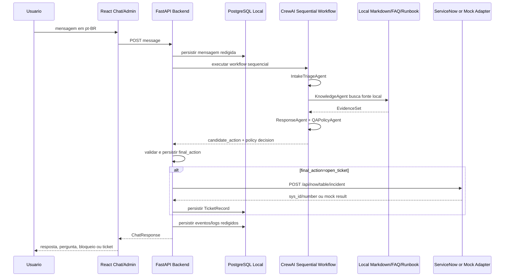

# System Architecture Document (SAD): Multi-Agent Customer Support Crew - MVP Slim

## Context & Instructions

Este SAD atualiza a arquitetura do MVP Slim para a fase Build do AAMAD. O escopo arquitetural fica restrito a uma fatia vertical de IT Help Desk interno em portugues brasileiro:

`chat -> agents -> conhecimento local -> decisao -> resposta ou ticket -> console admin`

O documento respeita o MRD/PRD como fonte de verdade, o runtime `crewai`, processo sequencial, `allow_delegation=false` por padrao, backend Python/FastAPI, frontend React/TypeScript, PostgreSQL local via Docker e integracao ServiceNow Table API para criacao de incidentes.

## Input Requirements

**PRD Document**: `project-context/1.define/prd.md`  
**MRD Document**: `project-context/1.define/mrd.md`  
**Existing SAD Reviewed**: `project-context/1.define/sad.md` anterior  
**Existing SFS Reviewed**: `project-context/1.define/sfs/multi-agent-support-flow.md`  
**Selected Runtime**: `crewai`  
**MVP Scope**: chat web, workflow sequencial CrewAI, busca local em markdown/FAQ/runbook, decisao final validada pelo backend, resposta ou ticket ServiceNow, persistencia PostgreSQL e console admin basico.

## 1. MVP Architecture Philosophy & Principles

### MVP Design Principles

- Entregar primeiro a fatia vertical demonstravel, sem transformar o capstone em plataforma enterprise de ITSM.
- Manter o workflow multiagente sequencial e auditavel, com contratos estruturados entre etapas.
- Usar conhecimento local simples em markdown/FAQ/runbook; vector DB, pgvector e ranking sofisticado ficam fora do P0.
- Tratar o backend como autoridade final para schema, dados minimos, seguranca, persistencia e `final_action`.
- Limitar acoes externas mutating a criacao de incidente ServiceNow via `POST /api/now/table/incident`.
- Redigir ou mascarar secrets/PII antes de persistencia, logs, eventos de agentes e ticketing.
- Tornar o console admin suficiente para demo e debugging, sem RBAC, autenticacao ou niveis de acesso no P0.

### Core vs Future Features

**MVP P0**:

- Web chat em portugues brasileiro.
- Backend FastAPI com endpoints para conversa, tickets, eventos de agentes, fontes usadas e metricas basicas.
- PostgreSQL local via Docker para conversas, mensagens, tickets, eventos de agentes e logs redigidos.
- Workflow sequencial CrewAI com agents/tasks externalizados em YAML.
- Busca local em arquivos markdown/FAQ/runbook definidos na fase Build antes do teste de integracao.
- Adapter ServiceNow real para criar incidente.
- Adapter ServiceNow mock/local para desenvolvimento e testes automatizados.
- Console admin aberto para conversas, tickets, fontes, decisoes, eventos e metricas simples.
- Testes unitarios das regras principais e teste de integracao `chat -> agents -> ticket`.

**P1/Future**:

- `handoff_required` como acao separada.
- RBAC, OIDC/autenticacao, multi-tenant e perfis de usuario.
- Slack/Teams, omnichannel e mobile completo.
- Vector DB/pgvector obrigatorio, sincronizacao incremental de conhecimento e sincronizacao incremental ServiceNow.
- OpenTelemetry/APM/SIEM completo, LLM-as-judge e evals sofisticados.
- Acoes externas mutating alem da criacao de incidente ServiceNow.

### Technical Architecture Decisions

| ID | Decision | Rationale | PRD/MRD Trace |
| :-- | :-- | :-- | :-- |
| ADR-001 | Runtime alvo `crewai` com processo sequencial | Alinha com AAMAD config, adapter CrewAI e necessidade de fluxo reproduzivel | PRD Runtime & Agent Specifications; MRD Critical Decision Points |
| ADR-002 | `allow_delegation=false` por padrao | Evita loops agenticos e delegacao opaca no MVP | PRD Runtime & Agent Specifications |
| ADR-003 | Backend FastAPI como boundary central | Centraliza validacao, seguranca, persistencia e integracao externa | PRD Technical Requirements |
| ADR-004 | Frontend React/TypeScript | Stack definida pelo PRD para chat e admin console | PRD Infrastructure Specifications |
| ADR-005 | PostgreSQL local via Docker | Banco P0 definido; evita SQLite como primario | PRD Integration Requirements |
| ADR-006 | Knowledge local sem vector DB obrigatorio | Base pequena e definida na Build; reduz setup e superficie de falha | MRD Technical Feasibility; PRD FR-003 |
| ADR-007 | ServiceNow incident adapter real + mock/local | Fecha a tese operacional e permite teste confiavel sem dependencia externa | PRD FR-006 |
| ADR-008 | Backend persiste `final_action` como autoridade final | `ResponseAgent` propoe, `QAPolicyAgent` veta, backend valida e grava | PRD Decision Rules |
| ADR-009 | Console admin aberto no P0 | Decisao fechada de produto; RBAC/auth ficam fora do MVP | PRD NFR Security & Compliance |

## 2. Multi-Agent System Specification

### Agent Architecture Requirements

O MVP usa cinco papeis agenticos em CrewAI. As definicoes de agents/tasks devem ficar em `config/agents.yaml` e `config/tasks.yaml`; o ponto de entrada pode ser `crew.py` ou modulo equivalente no backend. Todas as tasks usam `Process.sequential`, contexto explicito e outputs estruturados validaveis pelo backend.

| Agent | Responsibility | Input | Output | Tool Access |
| :-- | :-- | :-- | :-- | :-- |
| `IntakeTriageAgent` | Classificar solicitacao, categoria, impacto, urgencia, confianca e flags de risco | mensagem redigida, historico curto, estado da conversa | `TriageResult` | taxonomia local, regras deterministicas |
| `KnowledgeAgent` | Buscar fonte local aprovada aplicavel ao problema | `TriageResult`, repositorio local | `EvidenceSet` | leitor/buscador local de markdown/FAQ/runbook |
| `ResponseAgent` | Propor resposta, pergunta de esclarecimento, abertura de ticket ou bloqueio | estado, triagem, evidencias | `ResponseDraft` com `candidate_action` | sem ferramentas mutating |
| `QAPolicyAgent` | Validar seguranca, fonte suficiente, secrets/PII e acao proposta | `ResponseDraft`, triagem, evidencias | `PolicyDecision` | regras de seguranca e validadores |
| `TicketingEscalationAgent` | Preparar e enviar incidente quando `final_action=open_ticket` | decisao validada e dados minimos | `TicketRecord` | ServiceNow adapter real ou mock/local |

### Task / Turn Orchestration

1. Frontend envia mensagem para `POST /api/chat/sessions/{session_id}/messages`.
2. Backend valida tamanho, cria `request_id`/`agent_run_id`, redige secrets/PII conhecidos e persiste a mensagem redigida.
3. `IntakeTriageAgent` produz `internal_category`, `servicenow_category`, `impact`, `urgency`, `resulting_priority`, `confidence`, `risk_flags` e sugestao inicial.
4. Backend valida taxonomia, impacto/urgencia e prioridade derivada somente de categoria, impacto e urgencia.
5. `KnowledgeAgent` busca em markdown/FAQ/runbook local quando a resposta puder depender de fonte.
6. Backend marca fonte suficiente quando houver pelo menos um trecho de fonte aprovada com correspondencia clara da categoria interna e instrucao operacional aplicavel ao problema relatado.
7. `ResponseAgent` propoe `candidate_action` entre `respond`, `ask_clarification`, `open_ticket` ou `blocked`.
8. `QAPolicyAgent` pode aprovar a proposta ou vetar acao insegura para `blocked`.
9. Backend valida schema, dados minimos, contrato de seguranca, limite de uma pergunta de esclarecimento e persiste `final_action`.
10. Se `final_action=open_ticket`, `TicketingEscalationAgent` chama ServiceNow real ou mock/local com payload permitido.
11. Backend persiste resposta, ticket, eventos dos agentes e logs redigidos.
12. Frontend exibe resposta, pergunta, ticket criado ou bloqueio; console admin mostra eventos e decisoes.

### Expected Outputs and Data Formats

Todos os outputs devem ser JSON serializaveis e versionados com `contract_version`, `agent_run_id`, `session_id`, `producer`, `created_at`, `payload` e `validation_errors`.

- `TriageResult`: `internal_category`, `servicenow_category`, `impact`, `urgency`, `resulting_priority`, `confidence`, `risk_flags`, `missing_required_fields`.
- `EvidenceSet`: `sources[]` com `title`, `path`, `snippet`, `internal_category`, `approved=true|false` e `supports_operational_instruction=true|false`.
- `ResponseDraft`: `message_pt_br`, `candidate_action`, `clarification_question`, `ticket_summary`, `source_refs`, `safety_notes`.
- `PolicyDecision`: `approved`, `veto_to_blocked`, `policy_reasons`, `redaction_status`, `safe_for_user`, `safe_for_ticket`.
- `TicketRecord`: `local_ticket_id`, `servicenow_sys_id`, `servicenow_number`, `adapter_mode`, `status`, `redacted_payload`, `error_code`.

### Agent Contract and Decision Rules

Allowed actions P0: `respond`, `ask_clarification`, `open_ticket`, `blocked`.

- `confidence >= 0.70`: pode seguir sem esclarecimento se fonte, seguranca e dados necessarios forem suficientes.
- `confidence < 0.70`: deve fazer uma pergunta de esclarecimento se nenhuma pergunta anterior foi feita.
- `confidence < 0.70` apos uma pergunta: deve abrir ticket quando o pedido for legitimo e dados minimos forem seguros.
- `respond`: permitido quando categoria e fonte necessaria forem suficientes e nao houver risco de seguranca.
- `ask_clarification`: permitido no maximo uma vez por conversa para obter informacao essencial.
- `open_ticket`: permitido quando o usuario pedir ticket, quando fonte for insuficiente para resposta segura, quando baixa confianca persistir apos uma pergunta, ou quando suporte humano for necessario.
- `blocked`: obrigatorio para pedidos de revelar secrets, credentials, tokens, passwords, keys ou dados pessoais de terceiros.
- `handoff_required` nao e acao P0 e nao deve aparecer em contratos P0.

Taxonomia P0:

- `internal_category`: `password_reset`, `network_wifi`, `app_access`, `printer_label`, `critical_incident`, `applications_issues`, `unknown`.
- `servicenow_category`: `inquiry`, `software`, `hardware`, `network`, `database`.
- Mapeamento: `password_reset -> inquiry`; `network_wifi -> network`; `app_access -> software`; `printer_label -> hardware`; `critical_incident -> software`; `applications_issues -> software`; `unknown -> inquiry`.
- `impact` e `urgency`: `1`, `2` ou `3`.
- `resulting_priority`: `P1 critical` para `critical_incident` ou `impact=1` e `urgency=1`; `P2 high` para `impact=1` ou `urgency=1`; `P3 normal` para `impact=2` ou `urgency=2`; `P4 low` para `impact=3` e `urgency=3`.
- Prioridade nunca usa tipo de usuario, cargo, VIP, perfil, tier, status externo ou atributo pessoal.

### PII, Credentials and Secrets Flow

- Backend aplica redacao/mascara antes de persistir mensagens, logs, eventos ou tickets.
- `QAPolicyAgent` valida que resposta e ticket nao repetem secrets/PII desnecessaria.
- Secrets, credentials, tokens, passwords e keys sao mascarados ou removidos.
- Pedido para revelar segredo ou dado pessoal de terceiro vira `blocked`.
- Ticket automatico usa apenas contexto redigido; se a redacao impedir dados minimos, o backend deve pedir esclarecimento quando permitido ou bloquear quando inseguro.

### Error Handling, Retries, Cancellation and Timeouts

- Falha de schema interrompe o fluxo e retorna erro redigido ao frontend/admin.
- Falha de knowledge local nunca permite resposta inventada; escolhe `ask_clarification` ou `open_ticket` conforme regras.
- Falha ServiceNow preserva ticket local com status de erro reprocessavel e exibe estado no admin.
- Retry deve ser limitado e idempotente por `agent_run_id`.
- Cancelamento de chamada pelo cliente registra evento `cancelled` quando suportado pelo backend.

### Runtime-Conditional Configuration: CrewAI

- Required files: `config/agents.yaml`, `config/tasks.yaml`, `crew.py` ou equivalente.
- Process type: `sequential`.
- `allow_delegation=false` por padrao em todos os agentes.
- `memory=False` por padrao; estado de conversa fica no PostgreSQL.
- `Task.context` deve encadear explicitamente outputs validados.
- `max_iter <= 12`, preferencialmente menor para tasks P0.
- Tool allowlist minima por agente; ServiceNow tool somente no agente de ticketing.
- LLM provider, temperature, max tokens e rate controls ficam em env/config e devem ser registrados nos logs de runtime da Build sem expor secrets.

## 3. Frontend Architecture Specification

### Technology Stack

- React/TypeScript.
- UI em portugues brasileiro.
- API client tipado para backend FastAPI.
- Sem requisito P0 de SSR, mobile completo, autenticacao, RBAC ou biblioteca visual especifica.

### Application Structure

- `ChatPage`: cria/continua conversa, envia mensagem, exibe resposta, pergunta, bloqueio, ticket e fonte usada.
- `AdminConsolePage`: entrada aberta para demo com abas ou secoes simples.
- `TicketsList`: lista tickets locais/ServiceNow e status.
- `ConversationDetail`: mostra mensagens redigidas, eventos de agentes, fonte, decisao final e ticket associado.
- `MetricsSummary`: total de conversas, tickets criados, respostas com fonte e pedidos bloqueados.

### Interface Requirements

- Chat com historico, estado de carregamento e erro recuperavel.
- Exibir titulo/caminho/trecho da fonte quando houver resposta baseada em fonte.
- Exibir justificativa curta da decisao final sem chain-of-thought.
- Console admin sem login no P0, adequado a demo local/controlada.

## 4. Backend Architecture Specification

### API Architecture

Endpoints P0 recomendados:

- `POST /api/chat/sessions`
- `POST /api/chat/sessions/{session_id}/messages`
- `GET /api/chat/sessions/{session_id}`
- `GET /api/tickets`
- `GET /api/tickets/{ticket_id}`
- `GET /api/agent-runs/{agent_run_id}`
- `GET /api/metrics/summary`
- `GET /api/knowledge/sources`
- `GET /health`

Envelope HTTP recomendado:

```json
{
  "data": {},
  "error": null,
  "meta": {
    "request_id": "string",
    "agent_run_id": "string"
  }
}
```

### Data Architecture

Persistencia minima em PostgreSQL local:

- `chat_sessions`: sessao, status, timestamps, `clarification_count`.
- `chat_messages`: mensagens redigidas do usuario/sistema e metadados basicos.
- `agent_runs`: execucoes, status, duracao, modelo/config resumida, erro redigido.
- `agent_events`: eventos por etapa, inputs/outputs estruturados redigidos e decisao.
- `knowledge_sources`: arquivo local, titulo, path, categoria interna e status aprovado.
- `tickets`: ticket local, `servicenow_sys_id`, `servicenow_number`, categorias, impacto, urgencia, `resulting_priority`, status e payload redigido.
- `app_logs`: logs estruturados redigidos quando nao forem armazenados apenas em arquivos/STDOUT.

Nao ha tabelas P0 para tenants, roles, permissoes, OIDC identities ou perfis de prioridade.

### Runtime Integration Layer

- `AgentRuntimeService` encapsula CrewAI e normaliza entradas/saidas.
- Validadores Pydantic ou equivalentes verificam contratos antes/depois de cada task.
- O backend calcula e persiste `final_action`; agentes nao gravam diretamente no banco.
- Prompt/runtime trace na Build deve redigir secrets e pode registrar hashes/templates em vez de texto sensivel.

### ServiceNow Ticketing Integration Contract

Endpoint: `POST /api/now/table/incident`.

Payload outbound permitido e suficiente no P0:

```json
{
  "short_description": "Short issue summary",
  "description": "Relevant redacted context",
  "impact": "2",
  "urgency": "2",
  "category": "software"
}
```

Regras:

- Campos obrigatorios: `short_description`, `description`, `impact`, `urgency`, `category`.
- `priority` nao deve ser obrigatorio nem enviado como contrato P0.
- `resulting_priority` e calculada pela aplicacao para exibicao, auditoria e testes.
- Dados minimos para abrir ticket: descricao do problema, entendimento de `impact` e entendimento de `urgency`.
- `category` usa apenas `inquiry`, `software`, `hardware`, `network` ou `database`.
- Adapter mock/local deve implementar o mesmo contrato de request/response relevante para testes.

### Configuration and `.env` Strategy

Variaveis esperadas para `.env.example` da Build:

- `AAMAD_TARGET_RUNTIME=crewai`
- `APP_ENV=local`
- `DATABASE_URL=postgresql://...`
- `LLM_PROVIDER`
- `LLM_API_KEY`
- `SERVICENOW_BASE_URL`
- `SERVICENOW_INCIDENT_TABLE_PATH=/api/now/table/incident`
- `SERVICENOW_USERNAME`
- `SERVICENOW_PASSWORD`
- `SERVICENOW_CLIENT_ID` quando aplicavel
- `SERVICENOW_CLIENT_SECRET` quando aplicavel
- `SERVICENOW_AUTH_MODE` quando a Build escolher basic/OAuth conforme PDI disponivel
- `TICKET_ADAPTER_MODE=mock|servicenow`
- `KNOWLEDGE_BASE_PATH`
- `LOG_LEVEL`

Valores reais nunca devem ser commitados.

## 5. DevOps & Deployment Architecture

### Docker/PostgreSQL Local

- A fase Build deve fornecer `docker-compose.yml` ou equivalente para PostgreSQL local.
- Backend usa `DATABASE_URL` e migrations simples.
- ServiceNow real pode ser desligado localmente via `TICKET_ADAPTER_MODE=mock`.
- Knowledge local deve ser montado ou versionado em pasta do projeto, com dataset final definido antes do teste de integracao.

### CI/CD

Pipeline minimo recomendado:

- Instalar dependencias backend/frontend.
- Rodar lint/typecheck quando configurado.
- Rodar unit tests de regras principais.
- Rodar integration test `chat -> agents -> ticket` com adapter mock/local.
- Rodar build frontend/backend.

### Environments

- `local`: Postgres Docker, ServiceNow mock por default, knowledge local, logs verbosos.
- `demo`: single-tenant, ServiceNow real quando credenciais estiverem presentes, dados sinteticos/redigidos.
- Ambientes `staging`/`production` ficam Future.

### Observability

P0 registra:

- `request_id`, `session_id`, `agent_run_id`, `ticket_id`.
- Status e duracao por endpoint/task.
- `final_action`, categoria, impacto, urgencia e fonte usada.
- Falhas ServiceNow/mock, falhas de schema e bloqueios de seguranca.
- Logs estruturados redigidos.

OpenTelemetry, APM, SIEM, tracing distribuido e dashboards avancados ficam P1/Future.

## 6. Data Flow & Integration Architecture

### Primary Request/Response Path



### External Systems and Integration Points

- **LLM provider**: inferencia para agentes, configurado via env vars.
- **Knowledge local**: arquivos markdown/FAQ/runbook aprovados.
- **PostgreSQL local**: persistencia operacional P0.
- **ServiceNow Table API**: criacao de incidente via `POST /api/now/table/incident`.
- **ServiceNow mock/local**: substituto local para testes e desenvolvimento.

### Error Propagation

- Erros externos viram eventos redigidos e resposta segura ao usuario.
- Falha ServiceNow nao descarta conversa; preserva ticket local com erro.
- Falha de knowledge nao autoriza resposta sem fonte quando fonte for necessaria.

## 7. Performance & Scalability Specifications

### MVP Targets

- O fluxo deve parecer responsivo em demo; sem meta p95 rigida prometida no PRD.
- O teste de integracao deve completar em janela pratica para 8-12 casos.
- Timeouts ServiceNow devem retornar erro recuperavel e visivel no admin.

### Scaling Path

- Separar API e worker CrewAI.
- Adicionar fila para execucoes longas.
- Melhorar retrieval/ranking local.
- Introduzir autenticacao, RBAC e isolamento de tenant.
- Avaliar vector DB apenas apos validar a fatia vertical.

### Token and Cost Controls

- Limitar historico enviado ao runtime.
- Limitar numero de fontes por resposta.
- Registrar modelo, tokens/custo estimado quando disponivel.
- `max_rpm`, temperature e max tokens devem ser configuraveis.

## 8. Security & Compliance Architecture

### AuthN/AuthZ

- Console admin P0 e aberto, sem RBAC, niveis de acesso ou autenticacao.
- O MVP e single-tenant.
- Qualquer autenticacao/OIDC entra em P1/Future.

### Security Baselines

- Secrets somente via env vars ou secret manager futuro.
- Nenhum segredo em codigo, logs, Prompt Trace, datasets ou tickets.
- Redacao/mascara basica para tokens, passwords, keys e credentials.
- Bloqueio de pedidos inseguros envolvendo secrets ou dados pessoais de terceiros.
- Validacao de input/output em endpoints e contratos dos agentes.
- Tool allowlist minima; ServiceNow mutating tool restrita ao ticketing.

### Compliance Considerations

- Compliance enterprise formal fora do P0.
- Dados de demo devem ser sinteticos ou redigidos.
- Retencao, delecao e politicas LGPD completas ficam Future caso haja uso real.

## 9. Testing & Quality Assurance Specifications

### Test Strategy

- Unit tests para taxonomia, mapeamento ServiceNow, prioridade resultante, regra de confidence, limite de uma pergunta, criterio de fonte suficiente, redacao basica e payload ServiceNow.
- Unit tests para bloqueio de secrets/PII e ausencia de `priority` obrigatorio no payload outbound.
- Integration test `chat -> agents -> ticket` com adapter mock/local e PostgreSQL local.
- Teste condicionado com ServiceNow real apenas quando variaveis estiverem presentes.

### Runtime-Specific Quality Checks

- Validar `config/agents.yaml` e `config/tasks.yaml`.
- Confirmar `process=sequential` e `allow_delegation=false`.
- Confirmar tool allowlist minima por agente.
- Validar que `QAPolicyAgent` roda antes de resposta final ou ticket.

### PRD Coverage Review

| PRD item | SAD coverage | Status |
| :-- | :-- | :-- |
| FR-001 Web Chat | Frontend, API chat, persistencia de mensagens | Covered |
| FR-002 Intake & Triage | `IntakeTriageAgent`, taxonomia, prioridade | Covered |
| FR-003 Local Knowledge Search | Knowledge local e criterio de fonte suficiente | Covered |
| FR-004 Response Generation | `ResponseAgent`, pt-BR, fonte e uma pergunta | Covered |
| FR-005 QA & Policy Gate | `QAPolicyAgent`, redacao, bloqueios | Covered |
| FR-006 ServiceNow Ticketing | Adapter real/mock e contrato Table API | Covered |
| FR-007 Basic Admin Console | Tickets, conversa, eventos, fontes, metricas | Covered |
| FR-008 QA And Basic Observability | Unit tests, integration test, logs/eventos | Covered |

### Evaluation Criteria

O MVP nao exige LLM-as-judge nem evals sofisticados. A fase Build deve validar os criterios abaixo com testes code-based e, quando necessario, revisao manual simples:

| ID | Dimension | Metric | Threshold | Grading Method | Source |
| :-- | :-- | :-- | :-- | :-- | :-- |
| EC-001 | Accuracy | Categorias P0 classificadas no dataset | Pelo menos 5 categorias principais cobertas | Unit/integration dataset | PRD Success Metrics |
| EC-002 | Safety | Secrets intencionais persistidos em logs de testes | 0 ocorrencias | Log scan/test assertion | PRD Technical Metrics |
| EC-003 | Ticketing | Payload ServiceNow contem campos obrigatorios e nao exige `priority` | 100% dos casos de ticket | Contract test | PRD ServiceNow Ticketing Contract |
| EC-004 | Workflow | Integration test `chat -> agents -> ticket` | Passa com mock/local | Integration test | PRD FR-008 |
| EC-005 | UX | Resposta com fonte mostra titulo/caminho/trecho | 100% quando fonte usada | UI/API assertion | PRD FR-003/FR-007 |

## 10. MVP Launch & Feedback Strategy

### Pilot Criteria

- Backend, frontend, PostgreSQL e mock ServiceNow sobem localmente.
- ServiceNow real cria incidente quando credenciais estiverem configuradas.
- Knowledge local definido na Build antes do teste de integracao.
- Unit tests principais e integration test P0 passam.
- Console admin mostra conversa, ticket, fonte, eventos e metricas basicas.

### Success Metrics

- Chat cria e mantem conversa.
- Ticket ServiceNow/mock criado com `short_description`, `description`, `impact`, `urgency` e `category`.
- Console admin mostra ticket, conversa, fonte e decisao final.
- Dataset de 8-12 casos cobre fluxos principais definidos no PRD.

### SFS Impact

O arquivo `project-context/1.define/sfs/multi-agent-support-flow.md` foi mantido e substituido por uma SFS menor porque o fluxo integrado `chat -> agents -> ticket` e P0, reduz ambiguidade para frontend/backend/integration e ajuda diretamente o teste de integracao. O conteudo antigo foi removido quando tratava espanhol, `handoff_required`, vector/hybrid search, dataset 20-30, OIDC/RBAC ou outros itens P1/Future como se fossem P0.

## Implementation Guidance for AI Development Agents

1. `@project.mgr`: criar scaffold React/TypeScript, FastAPI, PostgreSQL Docker, env example, config CrewAI e estrutura de testes.
2. `@frontend.eng`: implementar chat e console admin basico em pt-BR.
3. `@backend.eng`: implementar schemas, persistencia, endpoints, runtime service, redacao e adapters ServiceNow real/mock.
4. `@integration.eng`: conectar frontend/backend/CrewAI/knowledge/ticketing no fluxo P0.
5. `@qa.eng`: implementar unit tests e integration test `chat -> agents -> ticket`.
6. `@security.eng`: revisar secrets, PII, logs, env vars e tool allowlist.
7. `@devops.eng`: empacotar compose, runbook, user guide e CI minimo.

## Architecture Validation Checklist

- [x] MRD, PRD, config AAMAD e adapter CrewAI revisados.
- [x] Runtime resolvido `crewai` registrado.
- [x] Escopo P0 limitado ao MVP Slim.
- [x] Itens P1/Future removidos do P0.
- [x] ServiceNow Table API e payload confirmado documentados.
- [x] `priority` nao e obrigatorio no payload outbound.
- [x] `handoff_required` movido para P1/Future.
- [x] Decisao sobre SFS registrada.

## Sources

- `AGENTS.md`
- `.github/instructions/aamad-core.instructions.md`
- `.github/instructions/adapter-crewai.instructions.md`
- `aamad.config.yml`
- `project-context/1.define/mrd.md`
- `project-context/1.define/prd.md`
- `project-context/1.define/sad.md` anterior, revisado e substituido
- `project-context/1.define/sfs/multi-agent-support-flow.md` anterior, revisado e substituido
- Solicitacao do operador em 2026-09-26 com decisoes fechadas do MVP Slim

## Assumptions

- `AAMAD_TARGET_RUNTIME` nao foi fornecido no ambiente da execucao; o runtime resolvido foi `crewai` a partir de `aamad.config.yml`, MRD e PRD.
- O ServiceNow PDI e credenciais reais serao configurados por `.env` na Build; o SAD nao registra valores secretos.
- A base de conhecimento local e o dataset de 8-12 casos serao definidos na fase Build antes do teste de integracao, conforme MRD/PRD.
- Console admin aberto e aceitavel apenas para ambiente local/demo single-tenant.
- A SFS permanece necessaria apenas como especificacao funcional curta do fluxo integrado P0; demais detalhes ficam no PRD/SAD para evitar duplicacao.

## Open Questions

- Quais arquivos markdown/FAQ/runbook serao marcados como fontes aprovadas iniciais?
- Quais 8-12 casos representativos comporao o dataset final de integracao?
- A Build usara ServiceNow Basic Auth ou OAuth para a PDI disponivel? O contrato arquitetural exige env vars e nunca secrets versionados, mas o modo exato pode depender da instancia.

## Audit

- Data/hora: 2026-09-26T02:23:54-03:00
- Persona id: `system-arch`
- Acao executada: `update-sad`
- Runtime resolvido: `crewai`
- Ferramentas/arquivos lidos: `AGENTS.md`; `.github/instructions/aamad-core.instructions.md`; `.github/instructions/adapter-crewai.instructions.md`; `aamad.config.yml`; `project-context/1.define/mrd.md`; `project-context/1.define/prd.md`; SAD anterior; `project-context/1.define/sfs/multi-agent-support-flow.md`; comando local `date -Iseconds` para timestamp.
- Decisao sobre SFS: manter e substituir `project-context/1.define/sfs/multi-agent-support-flow.md` por uma SFS menor, estritamente P0, porque ela orienta a implementacao/teste do fluxo integrado e remove conteudo obsoleto de escopo antigo.
- Prompt Trace: omitido porque este e um artefato de arquitetura da fase Define; as fontes materiais e decisoes fechadas estao registradas em `Sources`, `Assumptions` e `Audit`.